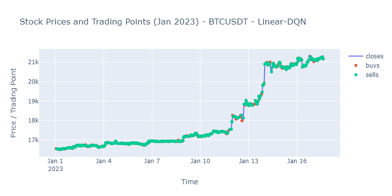

# Realtime-trading-project

The project's objective is to develop and contrast trading reinforcement learning algorithms using Linear-DQN and LSTM-DQN. Additionally, it involves the integration of real-time and continuous learning by combining Kafka and Apache Spark.

## Overview
\
In this project, we retrieve data from the Binance API websocket. Subsequently, this data is transmitted via Kafka to Spark. Spark then invokes a model for processing, performs automated buying and selling, and continues the training process. Following this, the buy or sell orders are sent back to the exchange, and the order placement data is stored in a Cassandra database.

## Install

- Clone project
```
git init
git clone https://github.com/Banana1206/Realtime-trading-project.git

```
- Install libraries
```
cd Realtime-trading-project
pip install -r requirements
```
- Install and run docker image
```
docker-compose -f docker-compose.yml up
```

## Achitecture Models

The Deep Q Network algorithm with the Target-Policy architecture for trading involves two neural networks: the Policy network and the Target network


\
The Target-Policy architecture is designed around two distinct neural networks: a Policy network for training and a Target network for prediction. Both networks operate concurrently during training and prediction of new data, with periodic updates achieved by assigning the Policy network's parameters to the Target network.

### Data

The dataset is obtained from Binance, spanning from January 2021 to January 2023, with a 1-hour time frame. This timeframe was chosen because 2021 had the most significant market fluctuations in the cryptocurrency market, and its data is used as a prediction basis for subsequent years.

The selected attributes for model training are as follows:

- open_time: The opening time of the cryptocurrency trade.
- close: The closing price of the cryptocurrency within that time interval.
- volume: The trading volume of the cryptocurrency within that time interval.
- count: The number of trades executed within that time interval.
- taker_buy_volume: The trading volume of taker trades (buy/sell at current prices).
- symbol: The name or code of the traded cryptocurrency.
In this study, data from five cryptocurrencies is used: BNBUSDT, BTCUSDT, ETHUSDT, LTCUSDT, XRPUSDT.

The model is constructed to predict the price of the Bitcoin cryptocurrency (BTCUSDT) using attributes and data from other cryptocurrencies. The inclusion of multiple cryptocurrencies aims to create a complex model capable of better generalization across diverse market conditions.


## Training

To train using the Linear-DQN model, follow these steps:
```
cd ./agents
py linearDQN_train.py
```
To train using the Lstm-DQN model, follow these steps:
```
cd ./agents
py lstmDQN_train.py
```

The results can be observed in the `visualize.ipynb` notebook.

## Results




